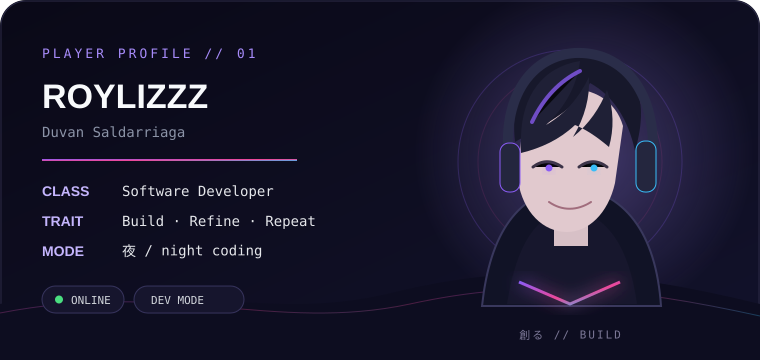

<div align="center">


<br/>


</div>


## `01 // WHO_AM_I`

<table>
<tr>
<td width="58%" valign="top">

### Hola, soy Duvan.

Desarrollador de software detrás de **`@Roylizzz`**.

Me gusta construir software que tenga una razón para existir: herramientas útiles, automatizaciones, interfaces limpias y sistemas que funcionen bien más allá de la demo.

Mi zona favorita está entre **backend, bases de datos, producto y UX**. Puedo pasar de una consulta SQL a una interfaz, de una integración a una app de escritorio y de una idea pequeña a convertirla en un sistema completo.

```txt
> build useful things
> remove unnecessary complexity
> make the experience feel good
> repeat
```

</td>
<td width="42%" align="center" valign="top">



</td>
</tr>
</table>


## `02 // LOADOUT`

<div align="center">


<br/><br/>


</div>

<br/>

```txt
MAIN        C# / .NET / Blazor / SQL
BUILDING    Web · Desktop · APIs · Automation
EXPLORING   React · TypeScript · Kotlin · PostgreSQL
INTERESTS   UX · Product · Systems · AI-assisted workflows
```


## `03 // MY_STYLE`

<table>
<tr>
<td width="25%" align="center">

### ⚙️ Systems
<sub>Me gusta entender cómo encajan todas las piezas, no solo hacer que compile.</sub>

</td>
<td width="25%" align="center">

### ✦ UX
<sub>Una herramienta puede ser poderosa sin sentirse complicada.</sub>

</td>
<td width="25%" align="center">

### ⛩️ Identity
<sub>Interfaces con personalidad. Oscuras, limpias y con un poco de anime.</sub>

</td>
<td width="25%" align="center">

### ↻ Evolution
<sub>Construir, probar, corregir y volver a mejorar.</sub>

</td>
</tr>
</table>


## `04 // CURRENT_ROUTE`

```yaml
player: Roylizzz
name: Duvan Saldarriaga
class: Software Developer
status: online

focus:
  - business software
  - automation
  - database-driven systems
  - clean interfaces
  - useful experiments

rules:
  - "simple outside, solid inside"
  - "understand the problem before writing the solution"
  - "if something repeats, automate it"
  - "good UX is part of the engineering"
```


## `05 // DEV_ENERGY`

<div align="center">

### `while (alive) { learn(); build(); improve(); }`

<br/>


<br/><br/>

> **「進化」 — keep evolving.**

<sub>software · systems · anime vibes · late-night ideas</sub>

<br/><br/>

<a href="https://github.com/Roylizzz">
  
</a>

</div>
