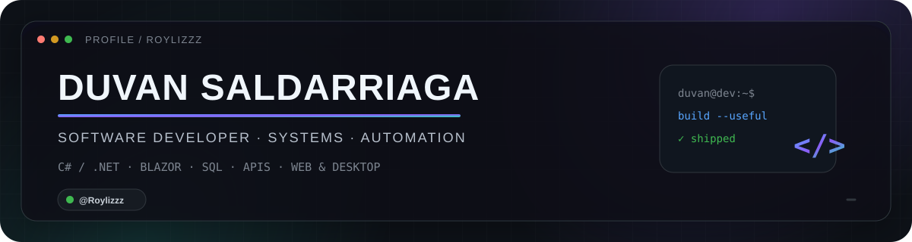
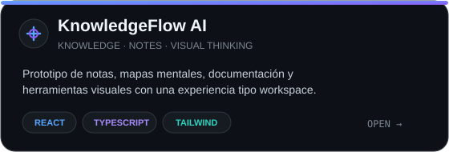
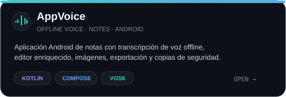

<div align="center">



<br/>

<a href="https://github.com/Roylizzz">
  
</a>


</div>

<br/>

## About me

Soy **Duvan Saldarriaga** (`@Roylizzz`), desarrollador de software enfocado en construir productos y herramientas que resuelvan problemas reales.

Trabajo especialmente con **C#/.NET, Blazor, SQL, APIs, automatización y aplicaciones empresariales**, pero también disfruto explorar productos web, Android, UX y nuevas formas de organizar información.

```txt
BUILD   → software útil, mantenible y claro
FOCUS   → sistemas · automatización · datos · producto
STYLE   → simple por fuera, sólido por dentro
```

## Tech stack

<div align="center">


<br/><br/>


</div>

## Featured projects

<table>
<tr>
<td width="50%" valign="top">
<a href="https://github.com/Roylizzz/knowledgeflow-ai">

</a>
</td>
<td width="50%" valign="top">
<a href="https://github.com/Roylizzz/AppVoice">

</a>
</td>
</tr>
</table>

<div align="center">

<a href="https://github.com/Roylizzz?tab=repositories">
  
</a>

</div>

## What I like to build

<table>
<tr>
<td width="25%" align="center"><b>Enterprise systems</b><br/><sub>Business logic, workflows and internal tools.</sub></td>
<td width="25%" align="center"><b>Automation</b><br/><sub>Less repetitive work, more reliable processes.</sub></td>
<td width="25%" align="center"><b>Data-driven apps</b><br/><sub>SQL, integrations, APIs and useful dashboards.</sub></td>
<td width="25%" align="center"><b>Product experiments</b><br/><sub>Web, Android, UX and new interfaces.</sub></td>
</tr>
</table>

## GitHub activity

<div align="center">


<br/>


</div>

---

<div align="center">

### Build useful things. Keep improving them.

<sub>C# · .NET · Blazor · SQL · React · TypeScript · Kotlin · Automation</sub>

<br/><br/>

<a href="https://github.com/Roylizzz">
  
</a>

</div>
