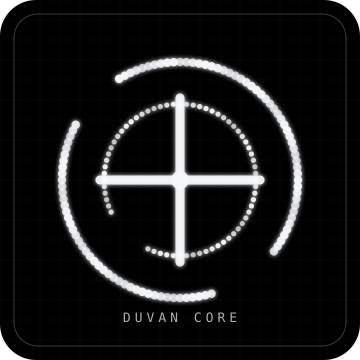
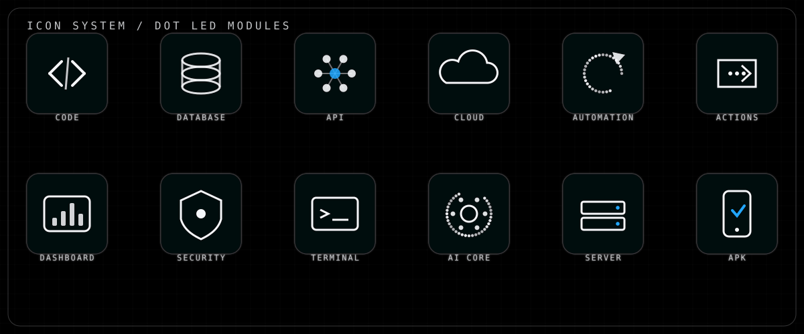
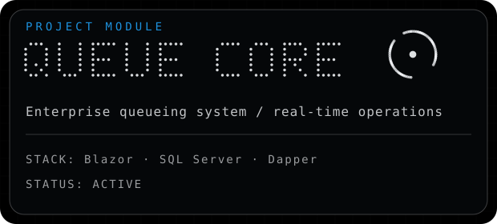
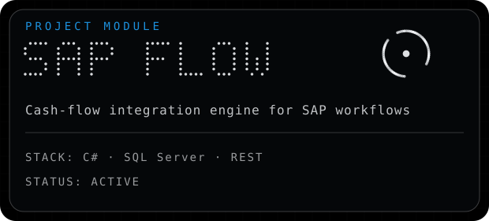
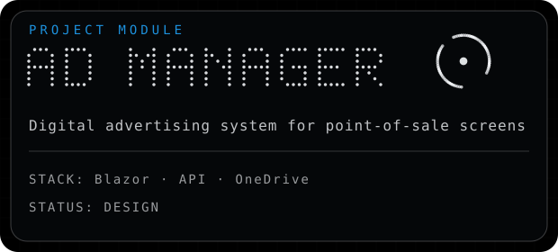
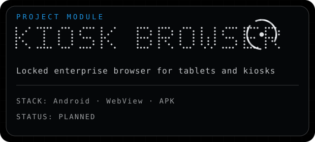

<div align="center">


<br/>


</div>

<br/>

```txt
╭──────────────────────────────────────────────────────────────────────────────╮
│ DUVAN CORE // SOFTWARE ENGINEERING SYSTEM                                    │
│ STATUS: ONLINE                                                               │
│ MODE: ENTERPRISE DEVELOPMENT                                                 │
│ FOCUS: BACKEND · DATABASE · BLAZOR · INTEGRATIONS · AUTOMATION               │
│ VERSION: PROFILE.IDENTITY.SYSTEM v1.0                                        │
╰──────────────────────────────────────────────────────────────────────────────╯
```


## 01 — ABOUT SYSTEM

Soy **Duvan Saldarriaga**, desarrollador de software enfocado en construir soluciones empresariales reales: sistemas internos, integraciones, dashboards, automatizaciones, aplicaciones web, aplicaciones de escritorio y herramientas que ayudan a que la operación de un negocio funcione mejor.

Trabajo principalmente con **.NET, C#, SQL Server, Blazor, Dapper, APIs REST, automatización e integraciones empresariales**. Me gusta crear sistemas que no se queden solo en lo visual: deben ser mantenibles, rápidos, claros y útiles para la operación.

```txt
SPECIALTY:
Backend systems · SQL Server · Blazor · APIs · Business logic · Automation
```

<table>
<tr>
<td width="33%" align="center">

</td>
<td width="67%">

### SYSTEM PROFILE

```txt
NAME............... DUVAN CORE
ROLE............... SOFTWARE DEVELOPER
MAIN STACK......... C# / .NET / SQL SERVER / BLAZOR
BUILD STYLE........ CLEAN · PRACTICAL · ENTERPRISE
CURRENT MODE....... SYSTEMS THAT SOLVE REAL PROBLEMS
```

</td>
</tr>
</table>

---

## 02 — TECH SYSTEM

<table>
<tr>
<td width="50%">

### CORE / BACKEND


</td>
<td width="50%">

### DATABASE


</td>
</tr>

<tr>
<td width="50%">

### FRONTEND / WEB


</td>
<td width="50%">

### DESKTOP / DEVOPS / TOOLS


</td>
</tr>
</table>

<br/>



---

## 03 — CURRENT FOCUS

```txt
[01] Enterprise software architecture
[02] SQL Server optimization and stored procedure design
[03] Blazor Server business systems
[04] SAP integration workflows
[05] Internal dashboards and reporting systems
[06] Deployment automation with GitHub Actions
[07] Web + mobile delivery pipelines
[08] AI-assisted productivity systems
```

---

## 04 — PROJECT GRID

<table>
<tr>
<td width="50%">
<a href="#">

</a>
</td>
<td width="50%">
<a href="#">

</a>
</td>
</tr>
<tr>
<td width="50%">
<a href="#">

</a>
</td>
<td width="50%">
<a href="#">

</a>
</td>
</tr>
</table>

> Reemplaza los `href="#"` por enlaces reales a tus repositorios cuando los tengas públicos o quieras destacarlos.

---

## 05 — DEVELOPMENT PIPELINE

```txt
╭──────────╮   ╭──────────╮   ╭──────────╮   ╭──────────╮
│ ANALYZE  │ → │ DESIGN   │ → │ BUILD    │ → │ TEST     │
╰──────────╯   ╰──────────╯   ╰──────────╯   ╰──────────╯
      ↓              ↓              ↓              ↓
╭──────────╮   ╭──────────╮   ╭──────────╮   ╭──────────╮
│ DATA     │ → │ API      │ → │ UI       │ → │ DEPLOY   │
╰──────────╯   ╰──────────╯   ╰──────────╯   ╰──────────╯
```

```txt
WORKFLOW:
01 — Understand the real business process.
02 — Design the database and the core logic.
03 — Build a reliable backend.
04 — Create a clean and useful interface.
05 — Integrate with existing systems.
06 — Test using real operational cases.
07 — Deploy, monitor and improve.
```

---

## 06 — GITHUB METRICS

<div align="center">


<br/>


<br/>


</div>

---

## 07 — SYSTEM IDENTITY

```txt
FUTURISTIC  ·  PRECISE  ·  MINIMAL  ·  INTELLIGENT  ·  ENGINEERED  ·  ENTERPRISE  ·  EXPERIMENTAL
```

<table>
<tr>
<td align="center"><b>FUTURISTIC</b><br/>Interfaces modernas y limpias.</td>
<td align="center"><b>PRECISE</b><br/>Lógica clara y controlada.</td>
<td align="center"><b>ENTERPRISE</b><br/>Soluciones para operación real.</td>
</tr>
<tr>
<td align="center"><b>DATABASE</b><br/>SQL Server como núcleo del sistema.</td>
<td align="center"><b>AUTOMATION</b><br/>Menos tareas repetitivas.</td>
<td align="center"><b>INTEGRATION</b><br/>Sistemas conectados y útiles.</td>
</tr>
</table>

---

## 08 — WORKING PRINCIPLES

```txt
01 — Build systems that solve real operational problems.
02 — Keep interfaces clean, useful and fast.
03 — Move business logic to reliable layers.
04 — Design databases with intention.
05 — Automate what is repetitive.
06 — Make deployment predictable.
07 — Improve continuously after real usage.
```

---

## 09 — CONNECT

<div align="center">

<a href="https://github.com/TU_USUARIO_GITHUB">
  
</a>

<a href="https://www.linkedin.com/in/TU_LINKEDIN">
  
</a>

<a href="mailto:TU_CORREO">
  
</a>

<a href="https://TU_PORTAFOLIO.com">
  
</a>

</div>

---


<div align="center">

`SYSTEM ONLINE · CODE IN MOTION · ENTERPRISE READY`

</div>
